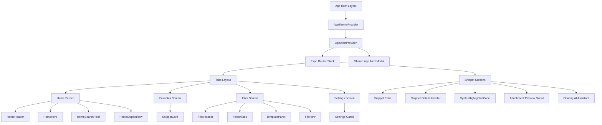
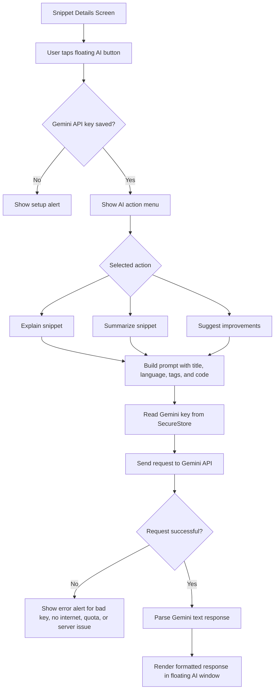

<p align="center">
  
</p>

<h1 align="center">DevShelf</h1>

<p align="center">
  Offline-first mobile code snippet manager with local files, favorites, exports, and Gemini-powered snippet explanations.
</p>

<p align="center">
  
  
  
  
  
</p>

## Overview

DevShelf is an Expo, React Native, and TypeScript mobile app for saving, organizing, exporting, and understanding reusable code snippets directly on-device. The app is offline-first for core snippet and file workflows, with optional Gemini-powered AI explanations when an internet connection and API key are available.

## Submission

| Item | Link |
| --- | --- |
| GitHub Repository | https://github.com/KOUSHIKG04/DevSnippets-AI |
| Demo Video | https://github.com/user-attachments/assets/3c7feb15-90ae-4f19-922d-bdbe750a5a41 |

## Demo Video

<video src="https://github.com/user-attachments/assets/3c7feb15-90ae-4f19-922d-bdbe750a5a41" controls width="320">
  Your browser does not support embedded videos. Open the demo video here:
  https://github.com/user-attachments/assets/3c7feb15-90ae-4f19-922d-bdbe750a5a41
</video>

## Screenshots

<p>
  
  
  
  
  
</p>

## Brief Explanation

DevShelf uses SQLite as the main offline database for snippet records and snippet attachment metadata. The app creates a `snippets` table for title, code, language, tags, favorite state, and timestamps, plus a `snippet_attachments` table that links locally saved screenshot files back to snippets. This keeps create, edit, delete, search, and favorite workflows available without an internet connection.

The offline storage approach separates data by responsibility. SQLite stores structured snippet data, AsyncStorage stores lightweight app preferences such as theme, default language, and editor font size, SecureStore stores the Gemini API key, and Expo FileSystem stores local files under app document storage. Because snippet and file operations read from local storage first, the core app remains usable offline.

File management is implemented with Expo FileSystem. The app creates local `exports`, `attachments`, and `templates` folders, then lets users save snippet exports, attach screenshots, browse stored files, delete files, copy or move files between supported folders, and use saved templates when creating snippets. Expo Sharing is used when the user wants to share an exported snippet or attachment with another app.

The AI workflow is optional and internet-dependent. The user saves a Gemini API key in Settings, the key is stored securely with SecureStore, and the Snippet Details screen can request an explanation, summary, or improvement suggestions for the selected snippet. The app sends the snippet title, language, tags, and code to Gemini, then renders the response in a formatted scrollable AI window.

## Navigation

| Section | What It Covers |
| --- | --- |
| [Submission](#submission) | Repository, demo video, and screenshots |
| [Tech Stack](#tech-stack) | Frameworks, storage, file, and AI tools |
| [Features](#features) | Core app capabilities |
| [Project Structure](#project-structure) | Main source folders and route layout |
| [Database Structure](#database-structure) | SQLite tables and local schema |
| [Offline Storage Approach](#offline-storage-approach) | Local-first persistence strategy |
| [File Management Implementation](#file-management-implementation) | Expo FileSystem folders and actions |
| [AI Integration Workflow](#ai-integration-workflow) | Gemini request flow and UX states |
| [Running The App](#running-the-app) | Local setup and checks |

## Tech Stack

| Layer | Technology |
| --- | --- |
| Mobile runtime | Expo SDK 55, React Native |
| Language | TypeScript |
| Navigation | Expo Router |
| Snippet database | SQLite via `expo-sqlite` |
| Preferences | AsyncStorage |
| Secrets | SecureStore |
| File storage | Expo FileSystem |
| Sharing | Expo Sharing |
| Attachments | Expo Image Picker |
| AI | Gemini API |

## Features

| Area | Highlights |
| --- | --- |
| Snippets | Create, edit, delete, search, favorite, and browse reusable code |
| Offline storage | SQLite-backed snippets and local file workflows keep working offline |
| Files | Browse exports, attachments, and templates; copy, move, delete, and use files |
| Attachments | Add screenshot attachments, preview them full-screen, and share them |
| Export | Save and share snippets as `.txt`, `.js`, and `.json` |
| AI assistant | Floating Gemini assistant for explanations, summaries, and improvements |
| Preferences | Theme, default language, editor font size, and secure Gemini key storage |
| UI polish | Dark/light theme, syntax-colored code, formatted AI responses, and native alerts |

## Project Structure

```txt
src/
  app/                 Expo Router screens only
    (tabs)/            Home, Favorites, Files, Settings
    snippet/           New, Edit, Details
  ai/                  Gemini AI service
  components/          Reusable UI components
  constants/           Shared constants such as language options
  db/                  SQLite database and snippet queries
  files/               Expo FileSystem and Sharing helpers
  storage/             AsyncStorage and SecureStore helpers
  types/               Shared TypeScript types
  theme.tsx            App theme provider
  fontDefaults.ts      App font helpers
```

Non-route code lives outside `src/app` so Expo Router does not treat utilities as screens.

## Component Workflow Chart



## Database Structure

SQLite database: `devsnippets.db`

Database setup lives in `src/db/database.ts`. Query and mutation helpers live in `src/db/snippet.ts`.

### `snippets`

Stores the core snippet data.

```sql
CREATE TABLE IF NOT EXISTS snippets (
  id INTEGER PRIMARY KEY AUTOINCREMENT,
  title TEXT NOT NULL,
  code TEXT NOT NULL,
  language TEXT NOT NULL,
  tags TEXT NOT NULL DEFAULT '[]',
  is_favorite INTEGER NOT NULL DEFAULT 0,
  created_at TEXT NOT NULL,
  updated_at TEXT NOT NULL
);
```

| Column | Purpose |
| --- | --- |
| `tags` | Stored as JSON text and parsed in the app |
| `is_favorite` | Stored as `0` or `1` |
| `updated_at` | Used for default snippet ordering |
| `title`, `code`, `language` | Used by local search |

### `snippet_attachments`

Stores local image attachment metadata linked to snippets.

```sql
CREATE TABLE IF NOT EXISTS snippet_attachments (
  id INTEGER PRIMARY KEY AUTOINCREMENT,
  snippet_id INTEGER NOT NULL,
  uri TEXT NOT NULL,
  type TEXT NOT NULL,
  created_at TEXT NOT NULL,
  FOREIGN KEY (snippet_id) REFERENCES snippets(id) ON DELETE CASCADE
);
```

Attachment files are stored with Expo FileSystem. SQLite stores the file URI and metadata, and deleting an attachment removes both metadata and the local file.

## Offline Storage Approach

DevShelf is local-first for its core workflows.

| Storage | Used For |
| --- | --- |
| SQLite | Snippets and attachment metadata |
| AsyncStorage | Theme, default language, and editor font size |
| SecureStore | Gemini API key |
| Expo FileSystem | Exports, attachments, and templates |

Works offline:

- create snippets
- edit snippets
- delete snippets
- search snippets
- view favorites
- attach and view already saved images
- browse local files
- export snippets locally
- use saved templates

Requires internet:

- Gemini AI explanation, summary, and improvement generation

## File Management Implementation

File helpers live in `src/files/fileService.ts`.

Local directories:

```txt
documentDirectory/devsnippets/
  exports/
  attachments/
  templates/
```

| Folder | Purpose |
| --- | --- |
| `exports` | Snippet files saved as `.txt`, `.js`, or `.json` |
| `attachments` | Screenshot/image files attached to snippets |
| `templates` | Starter templates and reusable local code resources |

Implemented file operations:

- create required directories
- save snippet exports
- list files by folder
- delete files
- copy files between folders
- move files between folders
- save image attachments
- read template files
- share files with the native share sheet

Files tab behavior:

- `Exports` shows locally exported snippets.
- `Attachments` shows saved image files.
- `Templates` shows starter template actions and saved template files.
- Template files can be opened into the New Snippet screen.

## AI Integration Workflow

AI generation uses Gemini through `src/ai/aiService.ts`.

Workflow:

1. User saves a Gemini API key in Settings.
2. The key is stored in SecureStore.
3. User opens a snippet detail screen.
4. User taps the floating `AI` button.
5. User chooses Explain, Summarize, or Improve.
6. The app reads the Gemini key from SecureStore.
7. The selected snippet title, language, tags, and code are sent to Gemini.
8. The generated response appears in the floating AI window.

AI UX handling:

| State | App Behavior |
| --- | --- |
| Missing key | Asks the user to add a Gemini API key in Settings |
| Bad key | Tells the user to check the saved Gemini key |
| No internet | Tells the user Gemini could not be reached |
| Rate limit or quota | Tells the user Gemini quota or rate limit was reached |
| Server issue | Tells the user Gemini is temporarily unavailable |
| Loading | Shows a loading state in the floating AI window |
| Long response | Scrolls inside the floating AI window |

Improve prompt behavior:

- Reviews the exact snippet only.
- Returns bugs/risks, readability improvements, performance/edge cases, and an improved code example only when useful.

## AI Workflow Chart



## Export And Sharing

Snippet detail supports:

- Save as `.txt`, `.js`, `.json` and share as `.txt`, `.js`, `.json`

Exports are saved locally before sharing so they also appear in the Files tab.

## Running The App

Install dependencies:

```bash
npm install
```

Start Expo:

```bash
npx expo start
```

Clear cache after route/file moves:

```bash
npx expo start -c
```

Run lint:

```bash
npm run lint
```

Run TypeScript check:

```bash
npx tsc --noEmit
```

Run React Doctor:

```bash
npx react-doctor@latest --verbose --diff
```
